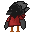

<h1 align="center">
<b> Hello Reader ! </b>
</h1>

- 😄 **Name**: *Axel Foucart* (known online as `Pizzel`) 

- 🔭 **Studies**: Currently studying at [Umons](https://web.umons.ac.be) for a master dregree in IT.
  - Currently in second year.

- ⚡ **Hobbies** : Coding, reading and of course video games.

- 🤔 **Why the weird username**: I dunno

<h2>
Tools :
</h2>

<h3>
Work environment :
</h3>

Here are a list of the tools I use daily in order to complete my projects :

<h3>
Proficient in :
</h3>

<h3>
Good with :
</h3>

<h1 align="center">
<b> 🛠️ Currently working : </b>
</h1>

* On [$\texttt{RITM}$](https://github.com/PizzaManStarted/ritm) which is a collection of tools used to better visualize the executions of Turing Machines (made entirely in **Rust**)
* 🤫 As an intern

<h1 align="center">
<b> 🔭 Future goals : </b>
</h1>

My hope is that I can one day join professionally the video game industry, either as a tool or gameplay programmer and for this reason I learned on the side the following programs :

  

<h1 align="center"> 🥀 Inspirational quotes </h1>

> *Why do they call it oven when you of in the cold food of out hot eat the food ?* -**Socrates** 